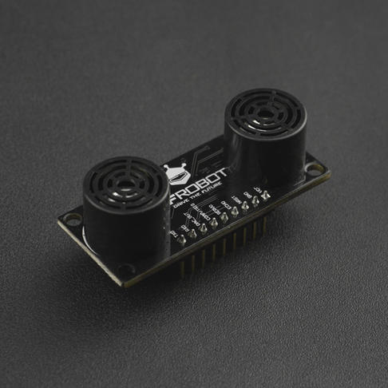

# DFRobot_Flash_Moudle
- [English Version](./README.md)

这是一个flash存储模块，采用esp32s2作为主控，板载了16M的W25Q128型号的flash存储芯片，该存储芯片单个块的擦写次数达10万次。此存储模块支持文件系统操作和U盘操作，既可以通过windows，linux等操作系统以操作U盘的方式，实现文件的创建、删除、拷贝、读写，也可以通过提供的Arduino平台的文件系统操作实现通过Arduino MCU在该存储模块创建、删除、注意，这两种方式不能同时进行操作，一次只能单独用一种方式操作该存储模块。此模块具有一下功能:

1.创建打开文件或目录 <br>
2.读写文件，文件文件格式不限(如.txt,.csv,.jpg) <br>
3.删除文件或目录 <br>
4.支持文件存储（文件类型包括但不限于文本文件或图片）<br>
5.能以U盘的方式在windows或Linux等系统上操作文件或目录 <br>
注意：如果要实现Arduino平台和Windows平台的文件操作，即一个文件可以被两个平台进行操作，请尽量不要使用长文件名，在操作系统上创建的文件或目录的名字加上扩展名在内不应该超过11个字符.<br>
这里需要显示拍照图片，可以一张图片，可以多张图片（不要用SVG图）




## 产品链接（链接到中文商城）

    SKU：DFR0870

## 目录

  * [概述](#概述)
  * [库安装](#库安装)
  * [方法](#方法)
  * [兼容性](#兼容性)
  * [历史](#历史)
  * [创作者](#创作者)

## 概述
1. 这是一个存储模块，能以文件的方式存储数据；<br>
2. 能在操作系统上以U盘的方式实现文件的创建、读写、删除;<br>
3. 内置fat12文件系统，可以通过UNO等主控实现文件的存储、读写、删除<br>
4. 目前主控代码操控方式只支持Arduino，不支持树莓派，树莓派只能操作U盘，不能用代码实现文件的控制。<br>
5. 支持CSV文件操作

U盘操作： 支持Window7/10, linux(树莓派)
文件系统驱动：目前只支持Arduino平台，暂不支持树莓派
## 库安装

使用此库前，请首先下载库文件，将其粘贴到\Arduino\libraries目录中，然后打开examples文件夹并在该文件夹中运行演示。

## 方法

```C++
  /**
   * @fn DFRobot_CsvFile
   * @brief 构造函数(分为无参和有参构造函数)
   * @param file DFRobot_File文件类对象指针，指向一个存在的文件对象
   * @return None
   */
  DFRobot_CsvFile();
  DFRobot_CsvFile(DFRobot_File *file);
  /**
   * @fn ~DFRobot_CsvFile
   * @brief 析构函数
   * @return None
   */
  ~DFRobot_CsvFile();
  /**
   * @fn begin
   * @brief 初始化函数
   * @return 初始化状态
   * @n     0: 初始化成功
   * @n     1: 构造函数中传入的形参file为空，或没传
   * @n     2: 传入的csv文件没有打开，请先打开该文件
   * @n     3: 传入的文件不是文件，是目录
   * @n     4: 传入的文件不是csv文件
   */
  uint8_t begin();
  /**
   * @fn getRow
   * @brief 获取当前csv文件的有效行数
   * @details 此csv文件最多支持写入(eLargestRow)1000行
   * @return 返回CSV文件最后一行的行号，范围0~1000，其中0代表该csv内容为空，没有数据，行号计数从1开始
   */
  int getRow();
  /**
   * @fn getColumn
   * @brief 获取当前csv文件中最后一列的列数，范围0~26
   * @details 此csv文件最多支持写入eLargestColumn（26）列，注意这里的列数是csv文件中所有行中，单元格最多的那一行，并不意味着每行都有那么多的列数。
   * @return 返回CSV文件最后一列的列号，范围0~26，其中0代表该csv内容为空，没有数据，列号计数从1开始
   */
  int getColumn();
  /**
   * @fn getRowsAndColumns
   * @brief 以指针的方式一次性获取csv文件的最大行和最大列
   * @details 行范围0~1000， 列范围：0~26
   * @param maxRow: 获取csv文件最后一行的行号，范围0~1000
   * @param maxCol: 获取csv文件列项最多的列号，范围0~26
   * @return None
   */
  void getRowsAndColumns(int *maxRow, int *maxCol);
  /**
   * @fn readRow
   * @brief 读取某一行的内容
   * @param row: 行号，从1开始，最大填1000(eLargestRow)
   * @return 返回该行的内容
   */
  String readRow(int row);
  /**
   * @fn writeRow
   * @brief 覆盖或写一行的内容
   * @param row: 行号，从1开始，最大填1000(eLargestRow)
   * @param rowData: 要写的内容
   * @n     如果rowData,用英文","区分每一列，如果存在/r/n，则会变成写多行
   * @return 返回写入的状态
   * @n     true: 写入成功
   * @n     false: 写入失败
   */
  bool writeRow(int row, const char *rowData);
  bool writeRow(int row, const String &rowData){ return writeRow(row, rowData.c_str());}
  /**
   * @fn deleteRow
   * @brief 删除此行的内容
   * @param row: 行号，从1开始，最大填1000(eLargestRow)，实际上最大有效值为调用getRow()的函数
   * @return 返回删除状态
   * @n     true: 删除成功
   * @n     false: 删除失败
   */
  bool deleteRow(int row);
  /**
   * @fn readColumn
   * @brief 读取某一列的内容
   * @details 每一列的内容，被读出来，readColumn会自动在每一项后面加上/r/n
   * @param col: 第几号，从1开始，最大填26(eLargestColumn)，实际上最大有效值为调用getColumn()的函数
   * @return 返回该列的内容
   */
  String readColumn(int col);
  
  /**
   * @fn writeColumn
   * @brief 覆盖或写一列的内容，起始列从1开始
   * @param col: 列号，从1开始，最大填1(eLargestRow)
   * @param colData: 要写的内容
   * @n     colData中，请用/r/n区分每一列的内容，colData字符串或数组中使用了字符','会导致某一行多一列数据 
   * @return 返回写入的状态
   * @n     true: 写入成功
   * @n     false: 写入失败
   */
  bool writeColumn(int col, const char *colData);
  bool writeColumn(int col, const String &colData){ return writeColumn(col, colData.c_str());}
  
  /**
   * @fn deleteColumn
   * @brief 删除此列的内容
   * @param col: 列的号，从1开始，最大填1000(eLargestRow)，实际上最大有效值为调用，实际上最大有效值为调用getColumn()的函数
   * @return 返回删除状态
   * @n     true: 删除成功
   * @n     false: 删除失败
   */
  bool deleteColumn(int col);
  /**
   * @fn readItem
   * @brief 读某行某列的内容
   * @param row: 行号，从1开始，最大填1000(eLargestRow)
   * @param col: 列编号，从1开始，最大填26(eLargestColumn)
   * @return 返回第row行的第col列数据的内容
   */
  String readItem(int row, int col);
  /**
   * @fn writeItem
   * @brief 修改或写某行某列的内容，允许某行某列不存在
   * @param row: 行号，从1开始，最大填1000(eLargestRow)
   * @param col: 列编号，从1开始，最大填26(eLargestColumn)
   * @param item: 要写的内容
   * @n     item里面最后好不要出现"/r/n"，或者","等字符，不然会改变原表的结构
   * @return 返回写入的状态
   * @n     true: 写入成功
   * @n     false: 写入失败
   */
  bool writeItem(int row, int col, const char *item);
  bool writeItem(int row, int col, const String &item){ return writeItem(row, col, item.c_str());}
  /**
   * @fn deleteItem
   * @brief 删除某一单元格的内容
   * @param row: 行号，从1开始，最大填1000(eLargestRow)
   * @param col: 列编号，从1开始，最大填26(eLargestColumn)
   * @return 返回删除状态
   * @n     true: 删除成功
   * @n     false: 删除失败
   */
  bool deleteItem(int row, int col);
  /**
   * @fn write
   * @brief 父类print重载，一个就是一项，顺序存储
   */
  virtual size_t write(uint8_t val);
  size_t write(const char *str) ;
  virtual size_t write(const uint8_t *buffer, size_t size);
  size_t write(const char *buffer, size_t size);
  /**
   * @fn print or println
   * @brief 父类print重载，print写一个单元格的数据，println写某行最后一项的数据，并发送行结束标志 '\r\n'
   */
  size_t print(const String &s);
  size_t print(const char str[]);
  size_t print(char c);
  size_t print(unsigned char b, int base = DEC);
  size_t print(int n, int base= DEC);
  size_t print(unsigned int n, int base= DEC);
  size_t print(long n, int base = DEC);
  size_t print(unsigned long n, int base= DEC);
  size_t print(double, int = 2);
  size_t println(const String &s);
  size_t println(const char str[]);
  size_t println(char c);
  size_t println(unsigned char b, int base = DEC);
  size_t println(int n, int base= DEC);
  size_t println(unsigned int n, int base= DEC);
  size_t println(long n, int base = DEC);
  size_t println(unsigned long n, int base= DEC);
  size_t println(double, int = 2);
  size_t println(void);

  /**
   * @fn DFRobot_File
   * @param f DFRobot_FlashFile类对象
   * @param name 文件名
   */
  DFRobot_File(DFRobot_FlashFile f, const char *name);

  /**
   * @fn DFRobot_File
   * @brief 'empty' constructor.
   */
  DFRobot_File(void);

  /**
   * @fn name
   * @brief 获取当前文件存储的目录名或文件名，这里只存了相对路径
   * @return 返回存储的文件名或目录名
   */
  char * name();
  /**
   * @fn write
   * @brief 向文件写入一个字符. 
   * @param val: 即将被写入的值
   * @return 返回实际写入的字符
   */
  virtual size_t write(uint8_t val);
  /**
   * @fn write
   * @brief 向文件写入多个字符. 
   * @param buf 指向要写入的数组的指针
   * @param size 要写入的字节的数量，需小于或等于buf指针所指向的数组的大小
   * @return 返回实际写入的字符
   */
  virtual size_t write(const uint8_t *buf, size_t size);
  /**
   * @fn read
   * @brief 从文件读取一字节内容，文件光标位置自动加1
   * @return 返回读取的字符
   */
  virtual int read();
  /**
   * @fn read
   * @brief 从文件中读取多个字节内容，文件读指针增加
   * @param buf 存储从文件中读取的数据
   * @param nbyte 要读取的字节的大小
   * @return 返回实际读取的大小
   */
  int read(void *buf, uint16_t nbyte);
  /**
   * @fn peek
   * @brief 查看当前位置的字节内容，不改变文件光标位置. 
   * @return 返回查看的内容值
   */
  virtual int peek();
  /**
   * @fn flush
   * @brief 等待数据被写入文件
   */
  virtual void flush();
  /**
   * @fn available
   * @brief 获取文件当前指针到文件结束位置字节
   * @return 返回文件当前指针到文件结束位置字节的数量
   */
  virtual int available();
  /**
   * @fn seek
   * @brief 设置文件的读写位置.
   * @param pos  新读写位置距离文件起始的距离
   * @return 设置状态
   * @n      true 设置成功
   * @n      false 设置失败
   */
  boolean seek(uint32_t pos);
  /**
   * @fn position
   * @brief 获取文件读写的当前位置，不支持目录.
   * @return 文件读写的当前位置.
   */
  uint32_t position();
  /**
   * @fn size
   * @brief 文件的大小，不支持目录获取大小
   * @return 文件的大小，单位字节数.
   */
  uint32_t size();
  /**
   * @fn close
   * @brief 关闭文件.
   */
  void close();
  /**
   * @fn isDirectory
   * @brief 检测但前文件是目录还是文件
   * @return 文件目录属性状态：
   * @n      true  此文件是目录
   * @n      false 此文件是文件
   */
  boolean isDirectory(void);
  /**
   * @fn del
   * @brief 删除文件里的内容(能不用，请尽量不要使用，flash有擦写次数限制，尽量不要使用)
   * @param pos 光标在文件中距离起始位置的位置
   * @param num 删除的字符数，如果是中文，请自动乘以2
   * @param flag 删除方向， 
   * @n     true: 删除光标前面的字符
   * @n     false: 删除光标后面的字符
   * @return 删除状态
   * @n     true: 成功
   * @n     false: 失败
   */
  boolean del(uint32_t pos, uint32_t num, bool flag = true);
  /**
   * @fn insert
   * @brief 在文件中的某个位置插入某个字符
   * @param pos 光标在文件中距离起始位置的位置
   * @param c 要插入的字符内容
   * @param num 在改位置插入多少个这个样的字符 
   * @return 插入状态
   * @n     true: 成功
   * @n     false: 失败
   */
  boolean insert(uint32_t pos, uint8_t c, uint32_t num);
  /**
   * @fn insert
   * @brief 在文件中的某个位置插入内容
   * @param pos 光标在文件中距离起始位置的位置
   * @param buf 存放要插入的文件内容
   * @param len 要插入的字节数 
   * @return 插入状态
   * @n     true: 成功
   * @n     false: 失败
   */
  boolean insert(uint32_t pos, void *buf, uint32_t len);
  /**
   * @fn openNextFile
   * @brief 打开当前目录下的所有文件或目录
   * @param mode 打开权限
   * @n     FILE_READ 以只读的方式打开
   * @return 返回文件对象DFRobot_File.
   */
  DFRobot_File openNextFile(uint8_t mode = FILE_READ);
  /**
   * @fn rewindDirectory
   * @brief 返回到被打开目录的初始位置.
   */
  void rewindDirectory(void);
  /**
  * @fn DFRobot_FlashMoudle
  * @brief 'empty' constructor.
  */
  DFRobot_FlashMoudle();
  /**
   * @fn begin
   * @brief flash模块初始化
   * @param drv DFRobot_Driver抽象类指针，可以传继承DFRobot_Driver类的所有子类对象的指针
   * @return 返回初始化结果
   * @retval 0 初始化成功
   * @retval others 初始化失败
   */
  uint8_t begin(DFRobot_Driver *drv);
  /**
   * @fn open
   * @brief 打开文件或目录
   * @details 以读写创建或只读的方式打开文件或目录，其中目录打开只能以只读的方式打开。
   * @param filepath 文件或目录的绝对路径，根目录为"/"
   * @n     根目录的目录或文件包含最多递归10级，/dir1/dir2/dir3/dir4/dir5/dir6/dir6/dir7/dir8/dir9, dir9下不能再创建任何目录和文件
   * @n     单个目录项名字不能超过11个字符
   * @param mode 打开权限
   * @n     FILE_READ  只读权限，此种方式可以打开文件或目录
   * @n     FILE_WRITE  读写创建权限，此种方式只可以打开文件，如果文件存在则以读写方式打开，如果不存在则创建一个新的文件再以写的方式打开     
   * @return 返回DFRobot_File类对象
   * @attention 可同时打开10个文件和10个目录（包含根目录），注意根目录由系统打开，用户无法关闭它
   */
  DFRobot_File open(const char *filepath, uint8_t mode = FILE_READ);
  DFRobot_File open(const String &filepath, uint8_t mode = FILE_READ);
  /**
   * @fn exists
   * @brief 查看某个文件或目录是否是否存在
   * @details 这里需传绝对路径
   * @param filepath 文件或目录的绝对路径
   * @return 返回创建状态
   * @retval true 创建成功或该目录已经存在
   * @retval false 创建失败
   */
  boolean exists(const char *filepath);
  boolean exists(const String &filepath);
  /**
   * @fn mkdir
   * @brief 创建目录
   * @param filepath 目录的绝对路径
   * @n     根目录的目录或文件包含最多递归10级，/dir1/dir2/dir3/dir4/dir5/dir6/dir6/dir7/dir8/dir9, dir9下不能再创建任何目录和文件
   * @n     单个目录项名字不能超过11个字符
   * @return 返回创建状态
   * @retval true 创建成功或该目录已经存在
   * @retval false 创建失败
   */
  boolean mkdir(const char *filepath);
  boolean mkdir(const String &filepath);
  /**
   * @fn remove
   * @brief 移除空文件夹或文件
   * @details 此函数用来删除文件，可以移除单个文件或空文件夹
   * @param filepath 目录的绝对路径，根目录为"/"
   * @n     根目录的目录或文件包含最多递归10级，/dir1/dir2/dir3/dir4/dir5/dir6/dir6/dir7/dir8/dir9, dir9下不能再创建任何目录和文件
   * @n     单个目录项名字不能超过11个字符
   * @return 返回移除状态
   * @retval true 移除成功
   * @retval false 移除失败
   */
  boolean remove(const char *filepath);
  boolean remove(const String &filepath);
  /**
   * @fn rmdir
   * @brief 移除空文件夹或文件
   * @details 此函数用来删除文件，可以移除单个文件或空文件夹
   * @param filepath 目录的绝对路径，根目录为"/"
   * @n     根目录的目录或文件包含最多递归10级，/dir1/dir2/dir3/dir4/dir5/dir6/dir6/dir7/dir8/dir9, dir9下不能再创建任何目录和文件
   * @n     单个目录项名字不能超过11个字符
   * @return 返回移除状态
   * @retval true 移除成功
   * @retval false 移除失败
   */
  boolean rmdir(const char *filepath);
  boolean rmdir(const String &filepath);
  /**
   * @fn begin
   * @brief IIC接口初始化
   * @return 返回初始化状态
   * @retval 0 初始化成功
   * @retval 1 DFRobot_FlashMoudle_IIC构造中传入的pWire为NULL
   * @retval 2 设备未找到
   */
  uint8_t begin(uint32_t freq = 1000);
  /**
   * @fn sendData
   * @brief  发送数据到I2C总线
   * @param pData 指向要发送的数据的指针
   * @param size 要发送的数据
   * @return None
   */
  virtual void sendData(void* pData, size_t size);
  /**
   * @fn recvData
   * @brief  从I2C总线上接收数据
   * @param pData 存储从IIC总线上接收的数据
   * @param size 需要接收的数据
   * @return 返回实际接收的数据的长度
   */
  virtual uint8_t recvData(void* pData, size_t size);
  /**
   * @fn writeReg
   * @brief  写寄存器
   * @param reg 寄存器地址
   * @param pData 指向要发送的数据的指针
   * @param size 要发送的数据
   * @return None
   */
  virtual void writeReg(uint8_t reg, void* pData, size_t size);
  /**
   * @fn readReg
   * @brief  从I2C总线上接收数据
   * @param reg 寄存器地址
   * @param pData 存储从IIC总线上接收的数据
   * @param size 需要接收的数据
   * @return 返回实际接收的数据的长度
   */
  virtual uint8_t readReg(uint8_t reg, void* pData, size_t size);
  /**
   * @fn flush
   * @brief  清空I2C接收缓冲区的数据
   * @return None
   */
  virtual void flush();
```

## 兼容性

主板               | 通过  | 未通过   | 未测试   | 备注
------------------ | :----------: | :----------: | :---------: | -----
Arduino uno        |      √       |              |             | 
Mega2560        |      √       |              |             | 
Leonardo        |      √       |              |             | 
ESP32           |      √       |              |             | 
ESP8266           |      √       |              |             | 
M0                |      √       |              |             | 
micro:bit        |      √       |              |             | 


## 历史

- 2021/11/19 - 1.0.0 版本

## 创作者

Written by Arya(xue.peng@dfrobot.com), 2019. (Welcome to our [website](https://www.dfrobot.com/))


